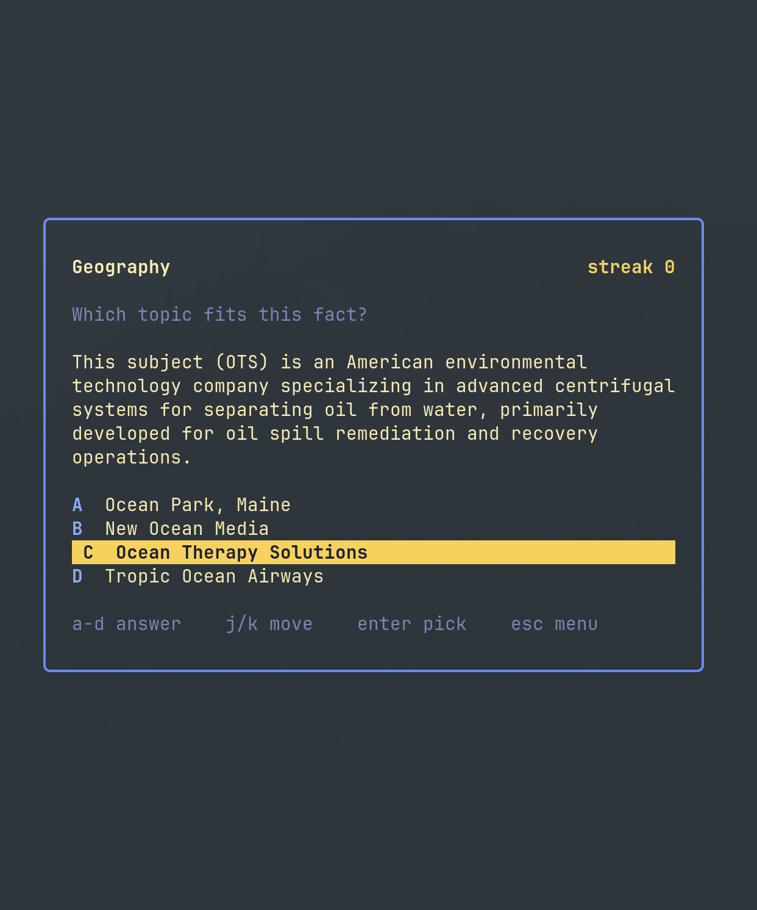

# quizgrok

A local quiz in the terminal. Pick a category, then answer until you miss. The streak counts correct answers in a row.



Each question is a live search against [Grokipedia](https://grokipedia.com) through [`github.com/benoute/grokipedia-mcp/pkg/grokipedia`](https://github.com/benoute/grokipedia-mcp). The game asks which topic a short snippet belongs to. Snippets are not saved. The streak lives in memory until you quit.

Built for [Omarchy](https://omarchy.org/). It is a TUI app, not an Omarchy shell plugin.

## Install on Arch / Omarchy

```bash
git clone https://github.com/Caleb-parrot/quizgrok.git
cd quizgrok
makepkg -si
```

That installs `/usr/bin/quizgrok` and a Super+Space launcher named **Quizgrok**.

`makepkg -s` installs Go from pacman. If Go is already on `PATH` from somewhere else, use `makepkg -si --nodeps` instead.

If you already have Go and do not want a package:

```bash
git clone https://github.com/Caleb-parrot/quizgrok.git
cd quizgrok
go build -o ~/.local/bin/quizgrok .
omarchy tui install Quizgrok ~/.local/bin/quizgrok tile applications-games
```

Optional Super-menu row — add this to `~/.config/omarchy/extensions/omarchy-menu.jsonc`:

```jsonc
"quizgrok": {
  "icon": "",
  "label": "Quizgrok",
  "description": "Grokipedia streak quiz",
  "action": "omarchy-launch-or-focus-tui --app-id=TUI.tile quizgrok"
}
```

Run from a checkout without installing:

```bash
cd quizgrok
go run .
```

Print one question and exit:

```bash
go run . -draw Space
```

## Keys

| Key | Where | What |
| --- | --- | --- |
| `1`-`9`, `j`/`k`, space, enter | Menu | Choose a category |
| `a` `s` `d` `f` or `1`-`4` | Question | Answer |
| `j`/`k`, space, enter | Question | Move and pick |
| space, enter | Miss | Same category, streak back to zero |
| esc | Question or miss | Category menu |
| `q` | Anywhere | Quit |

Best streak on the menu is for this sitting only.

## Layout

```
cmd is main.go          TUI entry
internal/quiz           categories, snippet trim, four choices
internal/grok           random category search, 8s timeout
internal/game           streak, in memory
internal/tui            menu and question screen
```

Every question is a random Grokipedia search in the category you picked, so a round lasts until you miss. A 429 or 5xx skips that draw and tries another page. The article text is never written to disk.

## License

All rights reserved. See [LICENSE](LICENSE).
